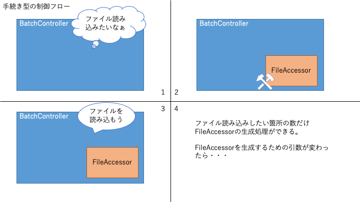
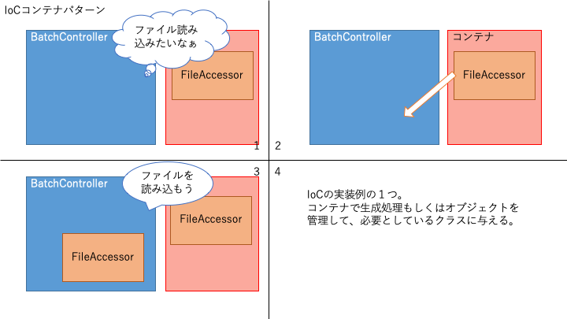
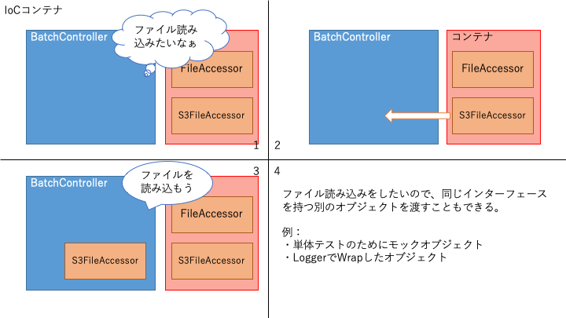

# Laravel 講習

## 事前準備

---

## 事前準備

- [Docker](https://www.docker.com/get-started)を動かす環境があること
- Laravelインストール
    - composerがインストールされていない人は公式Composerイメージを使おう
    - Laravel5.xを使います
    - `docker run --rm --interactive --tty --volume $PWD:/app composer create-project laravel/laravel:5.* demo --prefer-dist`

---

## 事前準備

- 実行環境構築
    - docker-composeに自信のない人は[magic-lamp](https://www.npmjs.com/package/magic-lamp)を使おう
    - Nodeをインストール → `npm i -g magic-lamp`
    - `cd demo`
    - `lamp create web db smtp`
    - `lamp start`
    - `lamp composer update`
    - docker-compose.ymlを見て.envのDB接続情報を設定

---

# Laravel 講習

## サービスコンテナ

(1〜2日)

---

## サービスコンテナ

元々は公式にIoCコンテナと呼ばれていたが、現在では単にコンテナ、またはサービスコンテナと呼ばれている。

→ IoCコンテナ？コンテナ？

---

## IoCってなに？

制御の反転（Inversion of Control）の略。
抽象化原則の一種で、手続き型プログラミングではプロシージャ（手続き）を「呼び出す側」が「呼び出される側」を制御していたが、それとは制御の流れが逆になるようにすること。

例えば）
BatchControllerクラスはFileAccessorオブジェクトを使う。
単純に手続きを書くと BatchController → FileAccessor という流れになる。
これを FileAccessor → BatchController という流れにすること。

---


---


---


---


---

IoCは依存性の注入（Dependency Injection）と一緒に語られることも多い。

> _依存性の注入(DI)..._
あるモジュール（や処理）が他のモジュールに依存しているとき、依存しているモジュールを外から注入すること。依存対象の知識を最低限にとどめる。

DIはIoCの実践方法のひとつ。
注入以外にも、Factoryパターン、イベント駆動アーキテクチャなどがある。

LaravelのサービスコンテナはFactoryの役割やDIの役割をする（他の役割もする）。

---

ハリウッド原則　と言ったりもする


「あなたの方から連絡してこないで。あなたが必要な時はこっちから連絡するから」

---

もちろんメリットとデメリットがある。
主なデメリットは、元が単純な手続きだった場合にかえって複雑になってしまうこと。

なんでもかんでも反転させればいい訳ではない！
目的をちゃんと理解することが大事。

---

## 結合と登録と解決

---

### 結合？

Laravelのサービスコンテナで「結合」とは、抽象クラス（またはキーワード）と実オブジェクトを結合するということ。

BatchControllerの例で言うと、
(´・ω・`) .｡o（ファイル読み込みしたいなぁ）が抽象クラス
　要件「readというメソッドにファイル名を渡したらコンテンツが返ってきてほしい」
　※このようなインプットとアウトプットの要件をPHPではインターフェースと言う
(´∀｀) 「S3FileAccessorあげます」が実オブジェクト

---

Laravelコンテナの結合関係を登録するメソッドのシグネチャ

```php
// \Illuminate\Contracts\Container\Container

/**
 * Register a binding with the container.
 *
 * @param  string  $abstract
 * @param  \Closure|string|null  $concrete
 * @param  bool  $shared
 * @return void
 */
public function bind($abstract, $concrete = null, $shared = false)
```

・`abstract`: 抽象クラスやインターフェースなど
・`concrete`: 実体クラスやファクトリ関数など
・`shared`: 最初に生成したオブジェクトを共有する（使い回す）かどうかのフラグ

---

#### 解決？

英語でresolve. 抽象オブジェクトから実オブジェクトを決定すること。
Laravelのコンテナでは`make`と`get`で解決できる。

> メモ： `get`は[PSR-11](https://www.ritolab.com/entry/107)に準拠するために実装されている。通常は`make`を使う

```php
// \Illuminate\Contracts\Container\Container

/**
 * Resolve the given type from the container.
 *
 * @param  string  $abstract
 * @param  array  $parameters
 * @return mixed
 *
 * @throws \Illuminate\Contracts\Container\BindingResolutionException
 */
public function make($abstract, array $parameters = []);
```

`app()`ヘルパや`resolve()`ヘルパでもできる。記述量も減るしわかりやすい。

---

#### Q. サービスコンテナってどこにあるの？どうやって使うの？

LaravelのApplicationクラスはサービスコンテナを継承しているのでLaravelの本体と言っても過言ではない（過言かも）。
Laravelというフレームワークを分解すると、便利なクラス群とそれらを管理するコンテナで出来ている。モダンなフルスタックフレームワークは大体こんな構成。

こんな方法でコンテナを取ってこれる
- `app()`ヘルパ
- `App`ファサード
- `Container`ファサード
- `Illuminate\Container\Container::getInstance()` （シングルトンパターン）
- `Illuminate\Contracts\Container\Container`を解決した実オブジェクト
などなど

「『コンテナが欲しい』と呼び出すと実オブジェクトとしてApplicationをくれる」

---

#### Q. 結合関係はどこで登録するのが一番いいの？

サービスプロバイダの`register`メソッド

なぜ？

サービスプロバイダの`register`セクションはアプリケーション起動の最初期に実行され、基本的にはサービスコンテナへの登録はすべてここでおこなわれる。
外で登録することもできるが、処理の前後関係を意識しないと解決できない場合がある。
定義自体が重かったり利用頻度が低いなどの場合には遅延で`register`を実行する仕組みもある（`defer`）。

---

### [実践] 趣味ポートフォリオを作ろう

※ 各講義で書いたソースコードは、GitHubの[HikaruYasuda/laravel-lesson-jul2020](https://github.com/HikaruYasuda/laravel-lesson-jul2020/tree/lesson/day1)リポジトリにタグを付けてコミットしておきます。

---

1. まずは登録するためのフォームを作る。

```sh
php artisan make:controller HomeController
```

> 以降`php artisan ・・・`コマンドは、magic-lampを使っている人は`lamp artisan ・・・`、docker-composeを使っている人は`docker-compose exec web php artisan ・・・`に読み替えてください。

---

2. トップページとデータ登録アクションを作る。

```php
// app\Http\Controllers\HomeController.php

// 略

public function index()
{
    return view('index');
}

public function store()
{
    return redirect()->route('index');
}
```

3. アクションのルートを定義する。

```php
// routes/web.php
Route::get('/', 'HomeController@index')->name('index');
Route::post('/create', 'HomeController@store')->name('store');
```

---

4. indexテンプレートを定義する。

`<head>`の内容などは[Bootstrap - Introduction](https://getbootstrap.jp/docs/4.5/getting-started/introduction/#%E3%82%B9%E3%82%BF%E3%83%BC%E3%82%BF%E3%83%BC%E3%83%86%E3%83%B3%E3%83%97%E3%83%AC%E3%83%BC%E3%83%88)を参考にして実装します。

```html
// resources/view/index.blade.php
<!doctype html>
<html lang="ja">
<head>(略)</head>
<body>
<nav class="navbar navbar-light bg-light">
    <a class="navbar-brand" href="/">{{ config('app.name') }}</a>
</nav>
<section class="container my-5">
    <div class="card">
        <div class="card-header">データを追加</div>
        <div class="card-body">
            <form method="post" action="{{ route('store') }}">
                @csrf
                <div class="form-group">
                    <label for="name">名前</label>
                    <input type="text" class="form-control" name="name" id="name">
                </div>
                <div class="form-group">
                    <label for="memo">メモ</label>
                    <textarea name="memo" id="memo" rows="4" class="form-control"></textarea>
                </div>
                <button type="submit" class="btn btn-primary">送信</button>
            </form>
        </div>
    </div>
</section>
<script>(略)</script>
</body>
</html>
```

---

5. ポートフォリオデータを保存したり取得したりするリポジトリを作る。

```php
// app/Repositories/PortfolioRepository.php
use Illuminate\Contracts\Filesystem\Filesystem;

class PortfolioRepository
{
    public function getAll()
    {
        $portfolios = collect();
        foreach (resolve(Filesystem::class)->files() as $path) {
            if ($path === '.gitignore') {
                continue;
            }
            $contents = resolve(Filesystem::class)->get($path);
            $portfolios[] = json_decode($contents, true);
        }
        return $portfolios;
    }

    public function create(array $data)
    {
        $json = collect($data)->only('name', 'memo')->toJson(JSON_UNESCAPED_UNICODE);

        resolve(Filesystem::class)->put("{$data['name']}.txt", $json);
    }
}
```

---

6. コントローラからリポジトリを呼び出す。

```php
// app\Http\Controllers\HomeController.php

// 略

public function index()
{
    $portfolios = resolve(PortfolioRepository::class)->getAll();

    return view('index', compact('portfolios'));
}

public function store(Request $request)
{
    resolve(PortfolioRepository::class)->create($request->all());

    return redirect()->route('index');
}
```

---

7. indexテンプレートにデータの一覧を追加

```html
<section class="container my-5">
    <h4><small>データ</small></h4>
    <div class="row">
        @foreach($portfolios as $portfolio)
            <div class="col-sm-6">
                <div class="card">
                    <div class="card-body">
                        <h5 class="card-title">{{ $portfolio['name'] }}</h5>
                        <p class="card-text">{{ $portfolio['memo'] }}</p>
                    </div>
                </div>
            </div>
        @endforeach
    </div>
</section>
```

---

8. リポジトリをシングルトンとして登録

```php
// app/Providers/AppServiceProvider.php

use App\Repositories\ThingRepository;

// 略

public function register()
{
    $this->app->singleton(ThingRepository::class);
}
```

一旦ここまででデータの登録と一覧表示ができました。

---

`App\Repositories\PortfolioRepository`のコンテナ登録でやったこと

```php
$this->app->singleton(PortfolioRepository::class);
```

これは

```php
//               abstract                    concrete                   shared
$this->app->bind(PortfolioRepository::class, PortfolioRepository::class, true);
```

したのと同じ登録定義になります。

---

**tinkerを使ってシングルトンの挙動を確認する**

tinkerでPortfolioRepositoryを解決してみる。
何度実行してもオブジェクトIDが変わらないことがわかる
 → 同じインスタンス。インスタンスのプロパティを共有できる。

```sh
$ php artisan tinker
>>> resolve(App\Repositories\PortfolioRepository::class)
=> App\Repositories\PortfolioRepository {#2985}
>>> resolve(App\Repositories\PortfolioRepository::class)
=> App\Repositories\PortfolioRepository {#2985}
```

singletonをbindに戻した場合は毎回オブジェクトIDが変わる
 → 別のインスタンス。インスタンスのプロパティはその場限り。

---

**抽象クラスから実オブジェクトへの解決フロー**

1. resolveやmakeなどで抽象クラスが要求される
　　↓
2. |　抽象クラスに対応したインスタンスが保存されている場合
　　　 → 保存されたインスタンスを返却
　　↓
3. |　concreteがクラス名の場合はビルド（インスタンス化）する。
|　concreteがファクトリ関数の場合は呼び出して結果を取得する。
　　↓
4. |　sharedがついている場合 3の結果をコンテナ内に保存する
　　↓
5. 実オブジェクトとして3の結果を返却する

---

#### コンストラクタでDIする

```php
// app/Repositories/PortfolioRepository.php

/**
 * @var \Illuminate\Contracts\Filesystem\Filesystem
 */
private $filesystem;

public function __construct(Filesystem $filesystem)
{
    $this->filesystem = $filesystem;
}
```

リポジトリで使っているファイルドライバを外から変更できるようになる

---

"**ビルド**"はコンテナがクラスをインスタンス化すること

ただし次の場合はインスタンス化できない

- インターフェースやabstractの付いたクラス(PHP的にはこれが抽象クラス)
- コンストラクタ(`__construct`)のアクセスレベルがpublicでないクラス
- コンストラクタに必要な引数がコンテナで用意できない
    - make()の第二引数でコンストラクタに使うパラメータを指定することもできる

次のような場合は、コンテナに暗黙ビルドさせる代わりにファクトリ関数を使った方がよい

- インスタンス化されるクラスを動的に切り替えたい
- 想定と違う引数でインスタンス化されちゃうけど毎回パラメータ使って解決したくない


---

`App\Repositories\PortfolioRepository`を登録しなくても動いていた

なんで？

→ 登録がない場合、コンテナは要求された抽象クラスを暗黙的にビルドして返却してくれる
　※ ビルドできない場合はエラー


---

PortfolioRepositoryの中、`resolve()`ヘルパで要求しているのはFilesystemのContract（契約）です。
> [公式Doc](https://readouble.com/laravel/5.8/ja/contracts.html)にもあるとおり、Laravelで"契約"とはインターフェイスのこと

```php
// app/Repositories/PortfolioRepository.php

use Illuminate\Contracts\Filesystem\Filesystem;

resolve(Filesystem::class)->put("{$data['name']}.txt", $json);
```

抽象クラス`Illuminate\Contracts\Filesystem\Filesystem`を要求すると、`config/filesystem.php`で設定されているデフォルトドライバのオブジェクトが返却されます。

---

#### クラス名以外で結合を登録する

結合は、抽象クラス名を使う代わりにキーワードになる文字列を使って登録することができる。

```php
$this->app->singleton('portfolios', PortfolioRepository::class);
```

この場合、portfoliosとPortfolioRepositoryの両方でインスタンスが保存されてしまうので、片方をエイリアスにする。

```php
//                解決に使う抽象クラス   紐付ける要求
$this->app->alias('portfolios', PortfolioRepository::class);
```

---

抽象クラス`Illuminate\Contracts\Filesystem\Filesystem`が実オブジェクトに解決されるフローは、少し複雑だがコンテナの仕組みを理解すれば追える。

---

## Eloquentとクエリビルダ

(1〜2日)

---

### Eloquentのおさらい

- EloquentはLaravelの[O/R Mapper]である
- Ruby on Railsなどでも使われる[ActiveRecord]というデザインパターンで、ラピッドプロトタイピングに向いている
    - テーブルがクラスに対応している
    - テーブルのレコード(行)がインスタンスに対応している
    - レコードを取得するとインスタンスとして扱える。インスタンスを保存するとレコードも更新される
- Eloquentでは1つのテーブル（またはビュー）を[Model]クラスに対応付けて実装する
- EloquentはLaravelの[クエリビルダ]を使ってDBアクセスしている

---

> 補足：ORMとは
> Object-Relational Mapper. O/R Mapper.
> SQLを使うデータベース（RDBMS）は基本的に単純な値しか格納できず、データベースでは複雑なデータは表とその関連する表として保存する。
> オブジェクト指向プログラミングで実装する際、オブジェクトをデータベースに格納可能な単純な値のグループに変換するか、プログラムをデータベースに合わせて単純な値だけを扱うようにしなければならない。O/Rマッピングはその前者の手法。

---

Eloquentの機能の大半はクエリビルダーを使っている

→ Eloquentの前にクエリビルダーを理解しよう

---

### クエリビルダーについて

- クエリ＝[データベース]への問い合わせのこと
- つまり[SQL]を組み立てるツール
- オブジェクト指向でデータベースアクセスできるPHP拡張モジュール[PDO]を使っている

---

> 補足：なぜPDOを使うか
> PHPにはmysqlやmssqlなどにアクセスする拡張モジュールもあるが、PDOはそれらをほぼ同じインターフェースで扱えるように設計されている。
> PDOはオブジェクト指向プログラミングできる。
> PDOにはprepared statement（クエリテンプレートとパラメータを分けられる）の仕組みがある。速度面・安全面でメリットがある。

---

#### [実践]クエリビルダを使い、データベースでポートフォリオを管理しよう

※ 通常はまずEloquentを使って素早く実装し、必要に応じてクエリビルダ化することが多いが、今回は機能を理解するために逆の手順で実装していこうと思います。

---

扱うデータは物・事なので
前回までで作った PortfolioRepository を ThingRepository
と変更してください。（※ ポートフォリオはThingが集まったもの）


HomeController, index.blade.php, AppServiceProvider も変更してください :bow:

---

データベースにテーブルを作ります。

```sh
php artisan make:migration CreateThingsTable
```

```php
public function up()
{
    Schema::create('things', function (Blueprint $table) {
        $table->bigIncrements('id');
        $table->string('name');
        $table->text('description')->nullable();
        $table->string('image')->nullable();
        $table->string('link')->nullable();
        $table->unsignedSmallInteger('rating')->nullable();
        $table->json('extra')->nullable();
        $table->timestamps();
    });
}
```

```sh
php artisan migrate
```

---

既存のThingRepositoryはコピーしてThingFileRepositoryにリネームしておき、DB接続版を実装していきます。

※ Contracts\ThingRepositoryでFilesystemの引数は消しておく（AppServiceProviderのconcreteもなおしておく）
FilesystemはStorageに変更。

---

```php
// ThingRepository.php

public function getAll()
{
    return DB::table('things')->get();
}

public function create(array $data)
{
    $values = collect($data)->only([
        'name',
        'description',
        'image',
        'link',
        'rating',
    ]);

    $keys = $data['extra']['keys'] ?? [];
    $attrs = $data['extra']['attrs'] ?? [];

    $extra = collect($keys)->mapWithKeys(function ($key, $i) use ($data) {
        $attr = $attrs[$i] ?? null;
        if (filled($key) && filled($attr)) {
            return [$key => $attr];
        }
        return [];
    });

    $values['extra'] = json_encode($extra, JSON_UNESCAPED_UNICODE);

    $id = DB::table('things')->insertGetId($values->all());

    return DB::table('things')->find($id);
}
```

---

項目が変更になったので `index.blade.php` を修正する.

以下に注意.
`$thing`が配列→オブジェクトに変わっている.
取得した`$thing->extra`はJSON.

---

クエリビルダーは`DB::table('things')`で作り、
get, find, first, insert, update, delete などのメソッドでクエリがビルド＆実行される。

---

#### 検索を追加しよう

```html
<div class="input-group mb-3">
  <input type="text" name="q" class="form-control">
  <div class="input-group-append">
    <span class="input-group-text">検索</span>
  </div>
</div>
```

---

Contracts\ThingRepositoryにsearchメソッドを追加

```php
// ThingRepository.php

public function search(array $params)
{
    $query = DB::table('things');

    foreach (array_filter($params, 'filled') as $key => $value) {
        switch ($key) {
            case 'q':
                // todo: %_のエスケープをする
                $query->where(function ($q) use ($value) {
                    $q->where('name', 'like', '')
                        ->orWhere('description', 'like', '');
                });
                break;
        }
    }

    return $query->get();
}

```

---

whereに渡したクロージャの第一引数もクエリビルダー

クエリビルダーにどんなメソッドがあるか確認してみよう。

---

#### Eloquentモデルでリポジトリを作ろう

同じようにThingRepositoryをコピーしてThingQbRepositoryにリネーム。
ThingRepositoryでEloquent実装をしてく。

---

Thingモデルを作る

→ 基本的にはDB::table()と同じように実装できることがわかる。

---

#### Q. クエリビルダとEloquentはどう使い分ける？

Eloquentは「モデル」が中心。
抽象的な定義をしておくだけで複雑なwhereやEagerLoadingをしてくれるので大抵の場合コード量が少なく済む。
モデルの定義とデータ利用の実装を分離できるので、分業しやすかったり変更しやすかったりする。

クエリビルダはSQLを作りやすくするだけ（直接SQLを書くよりは断然いい）。
１つのテーブルに捉われることなくユースケースに応じてjoin-selectしたりできる。

---

### Eloquentで拡張可能な機能（5.8時点）

- キャスト(cast)
- ミュテータ(mutator)
- スコープ(scope)
    - グローバルスコープ
    - ローカルスコープ
    - 論理削除(soft delete)
- イベントフック
    - bootメソッド
- リレーション(relation)

ひとつずつ見ていきます。

---

### キャスト(cast)

- DBから取得したデータは文字列、整数、実数としてモデルの属性に格納される※
- 論理値や日付などにキャストしたい場合は`$casts`プロパティでデータタイプを指定する

`Thing#extra`属性を`json`キャストするとjson_encode, json_decodeが不要になる。


> ※PDO(mysql)でカラムの型に合わせて整数・実数としてfetchされるのは、mysqlのドライバとしてmysqlndを使っていて、`PDO::ATTR_EMULATE_PREPARE` `PDO::ATTR_STRINGIFY_FETCHES`が共にfalseの場合に限る。

---

#### どんなキャストタイプがあるか確認しよう

@see `Illuminate\Database\Eloquent\Concerns\HasAttributes::castAttribute()`

|キャスト|型|
|---|---|
|int,integer|整数|
|real,float,double|浮動小数点数|
|decimal|実数の文字列|
|string|文字列|
|bool,boolean|論理値|
|object|オブジェクト|
|array,json|配列|
|collection|Collectionオブジェクト|
|date|時刻を除いたCarbonオブジェクト|
|datetime|Carbonオブジェクト|
|timestamp|UNIXタイムスタンプ|

---

#### キャストのタイミングは属性の取得時

- `echo $thing->extra` のように属性にアクセスした時にキャストされる
- `$thing->toArray()` `$thing->toJson()` のように配列化やJSON化する時は、キャストした上で日付が文字列フォーマットされる
    - フォーマット形式は$castsで`date:y-M-d`と指定できる

---

Laravel 7ではより柔軟にキャストできるようになっている

https://laravel.com/docs/7.x/eloquent-mutators#custom-casts

---

### アクセサとミュテータ

#### アクセサ

- 属性取得時のデータタイプ変換をメソッドで定義する
- 存在しない属性へのアクセスも定義できる
    - toArrayやtoJsonに含める場合は`$appends`プロパティに追加する
- 存在する属性の場合、オリジナルの値が引数に渡される

**メソッド名**

`get{属性名のパスカルケース}Attribute($value)`
例：属性名が`first_name` → `getFirstNameAttribute($value)`

---

#### ミュテータ

- アクセサの逆で、属性に値をセットする時のデータタイプ変換をメソッドで定義する
- 存在しない属性へのデータセットを実属性へ渡すことができる
- `$this->attributes[実属性のキー] = ?`で代入する

**メソッド名**

`set{属性名のパスカルケース}Attribute($value)`
例：属性名が`first_name` → `setFirstNameAttribute($value)`

---

##### 評価を0.5ずつ採点できるようにしよう

DBがinteger型なのでそのままでは保存できない。
10倍した値をDBに保存し、0.1倍した値を表示すればよい。

> 浮動小数点数の演算はずれることがあるので、この方法で保存した方がよい場合もある
https://www.php.net/manual/ja/language.types.float.php

---

### クエリスコープ

スコープは、クエリ結果に制約を追加する機能

- どんな時に使うか
    - 例: `active`カラムの値が1のレコードのみ
    - 例: `published_at`カラムの値が現在時刻以降のレコードのみ
    - 例: ログインユーザの所有するレコードのみ
- whereだけでなくorderByやaddSelectも付けられる
- グローバルスコープとローカルスコープがある

---

#### グローバルスコープ

モデルクラスに（静的）追加するスコープ。
そのモデルで発行するクエリすべてに制約が適用される（外すこともできる）。

クラスで定義する方法とクロージャで定義する方法がある。

---

##### クラスとして定義する場合

```php
// スコープクラス
use Illuminate\Database\Eloquent\Scope;

class AuthUserScope implements Scope
{
    private $user;
    public function __construct($user)
    {
        $this->user = $user;
    }

    /**
     * @param \Illuminate\Database\Eloquent\Builder $builder
     * @param \Illuminate\Database\Eloquent\Model $model
     */
    public function apply(Builder $builder, Model $model)
    {
        $builder->where('user_id', '=', $this->user->id);
    }
}

// モデル側
public static function boot() {
    parent::boot();

    static::addGlobalScope(new AuthUserScope(auth()->user()));
}
```

---

##### クロージャとして定義する場合
```php
// モデル
public static function boot() {
    parent::boot();

    static::addGlobalScope('authUser', function (Builder $builder) {
        $builder->where('user_id', '=', auth()->user()->id);
    });
}
```

---

##### グローバルスコープの削除

Eloquentクエリの途中、または新しくEloquentクエリを作る時に、特定のスコープを除外したクエリを作ることができる。

```php
// クラスの場合
Thing::withoutGlobalScope(AuthUserScope::class)->get();
// クロージャの場合
Thing::withoutGlobalScope('authUser')->get();
```

---

##### SoftDeletes

Laravelの`SoftDeletes`はグローバルスコープを使って論理削除を実現している。

どのように実装されているか見てみよう。

---

#### ローカルスコープ

インスタンスメソッドとして用意するスコープ。
好きなタイミングで呼び出して制約を適用できる。

**メソッド名**
`scope{スコープ名のパスカルケース}($query)`

**呼び出す時は**

---

```php
/**
 * 評価30以上に限定するスコープ
 *
 * @param  \Illuminate\Database\Eloquent\Builder  $query
 * @return \Illuminate\Database\Eloquent\Builder
 */
public function scopeRating($query)
{
    return $query->where('rating', '>=' 30);
}
```

適用する時
```php
Thing::rating()->get()
```

---

動的に条件を変更することもできる

```php
/**
 * 評価30以上に限定するスコープ
 *
 * @param  \Illuminate\Database\Eloquent\Builder  $query
 * @param int $min
 * @return \Illuminate\Database\Eloquent\Builder
 */
public function scopeRating($query, $min = 30)
{
    return $query->where('rating', '>=' $min);
}
```

適用する時
```php
Thing::rating(40)->get()
```

---

### イベントフック

モデルのライフサイクルに応じてフックが用意されています

- boot モデルクラスの初期化
- creating, created 新規追加
- updating, updated 更新
- saving, saved 追加or更新
- deleting, deleted 削除
- restoring, restored 論理削除からの復帰
- retrieved DBからの取得

---

次の方法で指定できる

- bootメソッドで各イベント時の処理をクロージャで指定する
- `$dispatchesEvents`でイベントクラスを指定する

```php
protected $dispatchesEvents = [
    'saved' => ThingSaved::class,
    'deleted' => ThingDeleted::class,
];
```

変更時にログを記録するように変更してみよう

---

### リレーション


