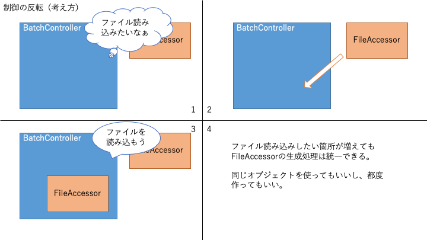

# Laravel 講習

## 事前準備

---

## 事前準備

- [Docker](https://www.docker.com/get-started)を動かす環境があること
- Laravelインストール
    - composerがインストールされていない人は公式Composerイメージを使おう
    - Laravel5.xを使います
    - `docker run --rm --interactive --tty --volume $PWD:/app composer create-project laravel/laravel:5.* demo --prefer-dist`

---

## 事前準備

- 実行環境構築
    - docker-composeに自信のない人は[magic-lamp](https://www.npmjs.com/package/magic-lamp)を使おう
    - Nodeをインストール → `npm i -g magic-lamp`
    - `cd demo`
    - `lamp create web db smtp`
    - `lamp start`
    - `lamp composer update`
    - docker-compose.ymlを見て.envのDB接続情報を設定

---

# Laravel 講習

## サービスコンテナ

(1〜2日)

---

## サービスコンテナ

元々は公式にIoCコンテナと呼ばれていたが、現在では単にコンテナ、またはサービスコンテナと呼ばれている。

→ IoCコンテナ？コンテナ？

---

## IoCってなに？

制御の反転（Inversion of Control）の略。
抽象化原則の一種で、手続き型プログラミングではプロシージャ（手続き）を「呼び出す側」が「呼び出される側」を制御していたが、それとは制御の流れが逆になるようにすること。

例えば）
BatchControllerクラスはFileAccessorオブジェクトを使う。
単純に手続きを書くと BatchController → FileAccessor という流れになる。
これを FileAccessor → BatchController という流れにすること。

---


---


---


---


---

IoCは依存性の注入（Dependency Injection）と一緒に語られることも多い。

> _依存性の注入(DI)..._
あるモジュール（や処理）が他のモジュールに依存しているとき、依存しているモジュールを外から注入すること。依存対象の知識を最低限にとどめる。

DIはIoCの実践方法のひとつ。
注入以外にも、Factoryパターン、イベント駆動アーキテクチャなどがある。

LaravelのサービスコンテナはFactoryの役割やDIの役割をする（他の役割もする）。

---

ハリウッド原則　と言ったりもする


「あなたの方から連絡してこないで。あなたが必要な時はこっちから連絡するから」

---

もちろんメリットとデメリットがある。
主なデメリットは、元が単純な手続きだった場合にかえって複雑になってしまうこと。

なんでもかんでも反転させればいい訳ではない！
目的をちゃんと理解することが大事。

---

## 結合と登録と解決

---

### 結合？

Laravelのサービスコンテナで「結合」とは、抽象クラス（またはキーワード）と実オブジェクトを結合するということ。

BatchControllerの例で言うと、
(´・ω・`) .｡o（ファイル読み込みしたいなぁ）が抽象クラス
　要件「readというメソッドにファイル名を渡したらコンテンツが返ってきてほしい」
　※このようなインプットとアウトプットの要件をPHPではインターフェースと言う
(´∀｀) 「S3FileAccessorあげます」が実オブジェクト

---

Laravelコンテナの結合関係を登録するメソッドのシグネチャ

```php
// \Illuminate\Contracts\Container\Container

/**
 * Register a binding with the container.
 *
 * @param  string  $abstract
 * @param  \Closure|string|null  $concrete
 * @param  bool  $shared
 * @return void
 */
public function bind($abstract, $concrete = null, $shared = false)
```

・`abstract`: 抽象クラスやインターフェースなど
・`concrete`: 実体クラスやファクトリ関数など
・`shared`: 最初に生成したオブジェクトを共有する（使い回す）かどうかのフラグ

---

#### 解決？

英語でresolve. 抽象オブジェクトから実オブジェクトを決定すること。
Laravelのコンテナでは`make`と`get`で解決できる。

> メモ： `get`は[PSR-11](https://www.ritolab.com/entry/107)に準拠するために実装されている。通常は`make`を使う

```php
// \Illuminate\Contracts\Container\Container

/**
 * Resolve the given type from the container.
 *
 * @param  string  $abstract
 * @param  array  $parameters
 * @return mixed
 *
 * @throws \Illuminate\Contracts\Container\BindingResolutionException
 */
public function make($abstract, array $parameters = []);
```

`app()`ヘルパや`resolve()`ヘルパでもできる。記述量も減るしわかりやすい。

---

#### Q. サービスコンテナってどこにあるの？どうやって使うの？

LaravelのApplicationクラスはサービスコンテナを継承しているのでLaravelの本体と言っても過言ではない（過言かも）。
Laravelというフレームワークを分解すると、便利なクラス群とそれらを管理するコンテナで出来ている。モダンなフルスタックフレームワークは大体こんな構成。

こんな方法でコンテナを取ってこれる
- `app()`ヘルパ
- `App`ファサード
- `Container`ファサード
- `Illuminate\Container\Container::getInstance()` （シングルトンパターン）
- `Illuminate\Contracts\Container\Container`を解決した実オブジェクト
などなど

「『コンテナが欲しい』と呼び出すと実オブジェクトとしてApplicationをくれる」

---

#### Q. 結合関係はどこで登録するのが一番いいの？

サービスプロバイダの`register`メソッド

なぜ？

サービスプロバイダの`register`セクションはアプリケーション起動の最初期に実行され、基本的にはサービスコンテナへの登録はすべてここでおこなわれる。
外で登録することもできるが、処理の前後関係を意識しないと解決できない場合がある。
定義自体が重かったり利用頻度が低いなどの場合には遅延で`register`を実行する仕組みもある（`defer`）。

---

### [実践] 趣味ポートフォリオを作ろう

※ 各講義で書いたソースコードは、GitHubの[HikaruYasuda/laravel-lesson-jul2020](https://github.com/HikaruYasuda/laravel-lesson-jul2020/tree/lesson/day1)リポジトリにタグを付けてコミットしておきます。

---

1. まずは登録するためのフォームを作る。

```sh
php artisan make:controller HomeController
```

> 以降`php artisan ・・・`コマンドは、magic-lampを使っている人は`lamp artisan ・・・`、docker-composeを使っている人は`docker-compose exec web php artisan ・・・`に読み替えてください。

---

2. トップページとデータ登録アクションを作る。

```php
// app\Http\Controllers\HomeController.php

// 略

public function index()
{
    return view('index');
}

public function store()
{
    return redirect()->route('index');
}
```

3. アクションのルートを定義する。

```php
// routes/web.php
Route::get('/', 'HomeController@index')->name('index');
Route::post('/create', 'HomeController@store')->name('store');
```

---

4. indexテンプレートを定義する。

`<head>`の内容などは[Bootstrap - Introduction](https://getbootstrap.jp/docs/4.5/getting-started/introduction/#%E3%82%B9%E3%82%BF%E3%83%BC%E3%82%BF%E3%83%BC%E3%83%86%E3%83%B3%E3%83%97%E3%83%AC%E3%83%BC%E3%83%88)を参考にして実装します。

```html
// resources/view/index.blade.php
<!doctype html>
<html lang="ja">
<head>(略)</head>
<body>
<nav class="navbar navbar-light bg-light">
    <a class="navbar-brand" href="/">{{ config('app.name') }}</a>
</nav>
<section class="container my-5">
    <div class="card">
        <div class="card-header">データを追加</div>
        <div class="card-body">
            <form method="post" action="{{ route('store') }}">
                @csrf
                <div class="form-group">
                    <label for="name">名前</label>
                    <input type="text" class="form-control" name="name" id="name">
                </div>
                <div class="form-group">
                    <label for="memo">メモ</label>
                    <textarea name="memo" id="memo" rows="4" class="form-control"></textarea>
                </div>
                <button type="submit" class="btn btn-primary">送信</button>
            </form>
        </div>
    </div>
</section>
<script>(略)</script>
</body>
</html>
```

---

5. ポートフォリオデータを保存したり取得したりするリポジトリを作る。

```php
// app/Repositories/PortfolioRepository.php
use Illuminate\Contracts\Filesystem\Filesystem;

class PortfolioRepository
{
    public function getAll()
    {
        $portfolios = collect();
        foreach (resolve(Filesystem::class)->files() as $path) {
            if ($path === '.gitignore') {
                continue;
            }
            $contents = resolve(Filesystem::class)->get($path);
            $portfolios[] = json_decode($contents, true);
        }
        return $portfolios;
    }

    public function create(array $data)
    {
        $json = collect($data)->only('name', 'memo')->toJson(JSON_UNESCAPED_UNICODE);

        resolve(Filesystem::class)->put("{$data['name']}.txt", $json);
    }
}
```

---

6. コントローラからリポジトリを呼び出す。

```php
// app\Http\Controllers\HomeController.php

// 略

public function index()
{
    $portfolios = resolve(PortfolioRepository::class)->getAll();

    return view('index', compact('portfolios'));
}

public function store(Request $request)
{
    resolve(PortfolioRepository::class)->create($request->all());

    return redirect()->route('index');
}
```

---

7. indexテンプレートにデータの一覧を追加

```html
<section class="container my-5">
    <h4><small>データ</small></h4>
    <div class="row">
        @foreach($portfolios as $portfolio)
            <div class="col-sm-6">
                <div class="card">
                    <div class="card-body">
                        <h5 class="card-title">{{ $portfolio['name'] }}</h5>
                        <p class="card-text">{{ $portfolio['memo'] }}</p>
                    </div>
                </div>
            </div>
        @endforeach
    </div>
</section>
```

---

8. リポジトリをシングルトンとして登録

```php
// app/Providers/AppServiceProvider.php

use App\Repositories\ThingRepository;

// 略

public function register()
{
    $this->app->singleton(ThingRepository::class);
}
```

一旦ここまででデータの登録と一覧表示ができました。

---

`App\Repositories\PortfolioRepository`のコンテナ登録でやったこと

```php
$this->app->singleton(PortfolioRepository::class);
```

これは

```php
//               abstract                    concrete                   shared
$this->app->bind(PortfolioRepository::class, PortfolioRepository::class, true);
```

したのと同じ登録定義になります。

---

**tinkerを使ってシングルトンの挙動を確認する**

tinkerでPortfolioRepositoryを解決してみる。
何度実行してもオブジェクトIDが変わらないことがわかる
 → 同じインスタンス。インスタンスのプロパティを共有できる。

```sh
$ php artisan tinker
>>> resolve(App\Repositories\PortfolioRepository::class)
=> App\Repositories\PortfolioRepository {#2985}
>>> resolve(App\Repositories\PortfolioRepository::class)
=> App\Repositories\PortfolioRepository {#2985}
```

singletonをbindに戻した場合は毎回オブジェクトIDが変わる
 → 別のインスタンス。インスタンスのプロパティはその場限り。

---

**抽象クラスから実オブジェクトへの解決フロー**

1. resolveやmakeなどで抽象クラスが要求される
　　↓
2. |　抽象クラスに対応したインスタンスが保存されている場合
　　　 → 保存されたインスタンスを返却
　　↓
3. |　concreteがクラス名の場合はビルド（インスタンス化）する。
|　concreteがファクトリ関数の場合は呼び出して結果を取得する。
　　↓
4. |　sharedがついている場合 3の結果をコンテナ内に保存する
　　↓
5. 実オブジェクトとして3の結果を返却する

---

#### コンストラクタでDIする

```php
// app/Repositories/PortfolioRepository.php

/**
 * @var \Illuminate\Contracts\Filesystem\Filesystem
 */
private $filesystem;

public function __construct(Filesystem $filesystem)
{
    $this->filesystem = $filesystem;
}
```

リポジトリで使っているファイルドライバを外から変更できるようになる

---

"**ビルド**"はコンテナがクラスをインスタンス化すること

ただし次の場合はインスタンス化できない

- インターフェースやabstractの付いたクラス(PHP的にはこれが抽象クラス)
- コンストラクタ(`__construct`)のアクセスレベルがpublicでないクラス
- コンストラクタに必要な引数がコンテナで用意できない
    - make()の第二引数でコンストラクタに使うパラメータを指定することもできる

次のような場合は、コンテナに暗黙ビルドさせる代わりにファクトリ関数を使った方がよい

- インスタンス化されるクラスを動的に切り替えたい
- 想定と違う引数でインスタンス化されちゃうけど毎回パラメータ使って解決したくない


---

`App\Repositories\PortfolioRepository`を登録しなくても動いていた

なんで？

→ 登録がない場合、コンテナは要求された抽象クラスを暗黙的にビルドして返却してくれる
　※ ビルドできない場合はエラー


---

PortfolioRepositoryの中、`resolve()`ヘルパで要求しているのはFilesystemのContract（契約）です。
> [公式Doc](https://readouble.com/laravel/5.8/ja/contracts.html)にもあるとおり、Laravelで"契約"とはインターフェイスのこと

```php
// app/Repositories/PortfolioRepository.php

use Illuminate\Contracts\Filesystem\Filesystem;

resolve(Filesystem::class)->put("{$data['name']}.txt", $json);
```

抽象クラス`Illuminate\Contracts\Filesystem\Filesystem`を要求すると、`config/filesystem.php`で設定されているデフォルトドライバのオブジェクトが返却されます。

---

#### クラス名以外で結合を登録する

結合は、抽象クラス名を使う代わりにキーワードになる文字列を使って登録することができる。

```php
$this->app->singleton('portfolios', PortfolioRepository::class);
```

この場合、portfoliosとPortfolioRepositoryの両方でインスタンスが保存されてしまうので、片方をエイリアスにする。

```php
//                解決に使う抽象クラス   紐付ける要求
$this->app->alias('portfolios', PortfolioRepository::class);
```

---

抽象クラス`Illuminate\Contracts\Filesystem\Filesystem`が実オブジェクトに解決されるフローは、少し複雑だがコンテナの仕組みを理解すれば追える。

---

## Eloquentとクエリビルダ

(1〜2日)

---

### Eloquentのおさらい

- EloquentはLaravelの[O/R Mapper]である
- Ruby on Railsなどでも使われる[ActiveRecord]というデザインパターンで、ラピッドプロトタイピングに向いている
    - テーブルがクラスに対応している
    - テーブルのレコード(行)がインスタンスに対応している
    - レコードを取得するとインスタンスとして扱える。インスタンスを保存するとレコードも更新される
- Eloquentでは1つのテーブル（またはビュー）を[Model]クラスに対応付けて実装する
- EloquentはLaravelの[クエリビルダ]を使ってDBアクセスしている

---

> 補足：ORMとは
> Object-Relational Mapper. O/R Mapper.
> SQLを使うデータベース（RDBMS）は基本的に単純な値しか格納できず、データベースでは複雑なデータは表とその関連する表として保存する。
> オブジェクト指向プログラミングで実装する際、オブジェクトをデータベースに格納可能な単純な値のグループに変換するか、プログラムをデータベースに合わせて単純な値だけを扱うようにしなければならない。O/Rマッピングはその前者の手法。

---

Eloquentの機能の大半はクエリビルダーを使っている

→ Eloquentの前にクエリビルダーを理解しよう

---

### クエリビルダーについて

- クエリ＝[データベース]への問い合わせのこと
- つまり[SQL]を組み立てるツール
- オブジェクト指向でデータベースアクセスできるPHP拡張モジュール[PDO]を使っている

---

> 補足：なぜPDOを使うか
> PHPにはmysqlやmssqlなどにアクセスする拡張モジュールもあるが、PDOはそれらをほぼ同じインターフェースで扱えるように設計されている。
> PDOはオブジェクト指向プログラミングできる。
> PDOにはprepared statement（クエリテンプレートとパラメータを分けられる）の仕組みがある。速度面・安全面でメリットがある。

---

#### [実践]クエリビルダを使い、データベースでポートフォリオを管理しよう

※ 通常はまずEloquentを使って素早く実装し、必要に応じてクエリビルダ化することが多いが、今回は機能を理解するために逆の手順で実装していこうと思います。

---

扱うデータは物・事なので
前回までで作った PortfolioRepository を ThingRepository
と変更してください。（※ ポートフォリオはThingが集まったもの）


HomeController, index.blade.php, AppServiceProvider も変更してください :bow:

---

データベースにテーブルを作ります。

```sh
php artisan make:migration CreateThingsTable
```

```php
public function up()
{
    Schema::create('things', function (Blueprint $table) {
        $table->bigIncrements('id');
        $table->string('name');
        $table->text('description')->nullable();
        $table->string('image')->nullable();
        $table->string('link')->nullable();
        $table->unsignedSmallInteger('rating')->nullable();
        $table->json('extra')->nullable();
        $table->timestamps();
    });
}
```

```sh
php artisan migrate
```

---

既存のThingRepositoryはコピーしてThingFileRepositoryにリネームしておき、DB接続版を実装していきます。

※ Contracts\ThingRepositoryでFilesystemの引数は消しておく（AppServiceProviderのconcreteもなおしておく）
FilesystemはStorageに変更。

---

```php
// ThingRepository.php

public function getAll()
{
    return DB::table('things')->get();
}

public function create(array $data)
{
    $values = collect($data)->only([
        'name',
        'description',
        'image',
        'link',
        'rating',
    ]);

    $keys = $data['extra']['keys'] ?? [];
    $attrs = $data['extra']['attrs'] ?? [];

    $extra = collect($keys)->mapWithKeys(function ($key, $i) use ($data) {
        $attr = $attrs[$i] ?? null;
        if (filled($key) && filled($attr)) {
            return [$key => $attr];
        }
        return [];
    });

    $values['extra'] = json_encode($extra, JSON_UNESCAPED_UNICODE);

    $id = DB::table('things')->insertGetId($values->all());

    return DB::table('things')->find($id);
}
```

---

項目が変更になったので `index.blade.php` を修正する.

以下に注意.
`$thing`が配列→オブジェクトに変わっている.
取得した`$thing->extra`はJSON.

---

クエリビルダーは`DB::table('things')`で作り、
get, find, first, insert, update, delete などのメソッドでクエリがビルド＆実行される。

---

#### 検索を追加しよう

```html
<div class="input-group mb-3">
  <input type="text" name="q" class="form-control">
  <div class="input-group-append">
    <span class="input-group-text">検索</span>
  </div>
</div>
```

---

Contracts\ThingRepositoryにsearchメソッドを追加

```php
// ThingRepository.php

public function search(array $params)
{
    $query = DB::table('things');

    foreach (array_filter($params, 'filled') as $key => $value) {
        switch ($key) {
            case 'q':
                // todo: %_のエスケープをする
                $query->where(function ($q) use ($value) {
                    $q->where('name', 'like', '')
                        ->orWhere('description', 'like', '');
                });
                break;
        }
    }

    return $query->get();
}

```

---

whereに渡したクロージャの第一引数もクエリビルダー

クエリビルダーにどんなメソッドがあるか確認してみよう。

---

#### Eloquentモデルでリポジトリを作ろう

同じようにThingRepositoryをコピーしてThingQbRepositoryにリネーム。
ThingRepositoryでEloquent実装をしてく。

---

Thingモデルを作る

→ 基本的にはDB::table()と同じように実装できることがわかる。

---

#### Q. クエリビルダとEloquentはどう使い分ける？

Eloquentは「モデル」が中心。
抽象的な定義をしておくだけで複雑なwhereやEagerLoadingをしてくれるので大抵の場合コード量が少なく済む。
モデルの定義とデータ利用の実装を分離できるので、分業しやすかったり変更しやすかったりする。

クエリビルダはSQLを作りやすくするだけ（直接SQLを書くよりは断然いい）。
１つのテーブルに捉われることなくユースケースに応じてjoin-selectしたりできる。

---

### Eloquentで拡張可能な機能（5.8時点）

- キャスト(cast)
- ミュテータ(mutator)
- スコープ(scope)
    - グローバルスコープ
    - ローカルスコープ
    - 論理削除(soft delete)
- イベントフック
    - bootメソッド
- リレーション(relation)

ひとつずつ見ていきます。

---

### キャスト(cast)

- DBから取得したデータは文字列、整数、実数としてモデルの属性に格納される※
- 論理値や日付などにキャストしたい場合は`$casts`プロパティでデータタイプを指定する

`Thing#extra`属性を`json`キャストするとjson_encode, json_decodeが不要になる。


> ※PDO(mysql)でカラムの型に合わせて整数・実数としてfetchされるのは、mysqlのドライバとしてmysqlndを使っていて、`PDO::ATTR_EMULATE_PREPARE` `PDO::ATTR_STRINGIFY_FETCHES`が共にfalseの場合に限る。

---

#### どんなキャストタイプがあるか確認しよう

@see `Illuminate\Database\Eloquent\Concerns\HasAttributes::castAttribute()`

|キャスト|型|
|---|---|
|int,integer|整数|
|real,float,double|浮動小数点数|
|decimal|実数の文字列|
|string|文字列|
|bool,boolean|論理値|
|object|オブジェクト|
|array,json|配列|
|collection|Collectionオブジェクト|
|date|時刻を除いたCarbonオブジェクト|
|datetime|Carbonオブジェクト|
|timestamp|UNIXタイムスタンプ|

---

#### キャストのタイミングは属性の取得時

- `echo $thing->extra` のように属性にアクセスした時にキャストされる
- `$thing->toArray()` `$thing->toJson()` のように配列化やJSON化する時は、キャストした上で日付が文字列フォーマットされる
    - フォーマット形式は$castsで`date:y-M-d`と指定できる

---

Laravel 7ではより柔軟にキャストできるようになっている

https://laravel.com/docs/7.x/eloquent-mutators#custom-casts

---

### アクセサとミュテータ

#### アクセサ

- 属性取得時のデータタイプ変換をメソッドで定義する
- 存在しない属性へのアクセスも定義できる
    - toArrayやtoJsonに含める場合は`$appends`プロパティに追加する
- 存在する属性の場合、オリジナルの値が引数に渡される

**メソッド名**

`get{属性名のパスカルケース}Attribute($value)`
例：属性名が`first_name` → `getFirstNameAttribute($value)`

---

#### ミュテータ

- アクセサの逆で、属性に値をセットする時のデータタイプ変換をメソッドで定義する
- 存在しない属性へのデータセットを実属性へ渡すことができる
- `$this->attributes[実属性のキー] = ?`で代入する

**メソッド名**

`set{属性名のパスカルケース}Attribute($value)`
例：属性名が`first_name` → `setFirstNameAttribute($value)`

---

##### 評価を0.5ずつ採点できるようにしよう

DBがinteger型なのでそのままでは保存できない。
10倍した値をDBに保存し、0.1倍した値を表示すればよい。

> 浮動小数点数の演算はずれることがあるので、この方法で保存した方がよい場合もある
https://www.php.net/manual/ja/language.types.float.php

---

### クエリスコープ

スコープは、クエリ結果に制約を追加する機能

- どんな時に使うか
    - 例: `active`カラムの値が1のレコードのみ
    - 例: `published_at`カラムの値が現在時刻以降のレコードのみ
    - 例: ログインユーザの所有するレコードのみ
- whereだけでなくorderByやaddSelectも付けられる
- グローバルスコープとローカルスコープがある

---

#### グローバルスコープ

モデルクラスに（静的）追加するスコープ。
そのモデルで発行するクエリすべてに制約が適用される（外すこともできる）。

クラスで定義する方法とクロージャで定義する方法がある。

---

##### クラスとして定義する場合

```php
// スコープクラス
use Illuminate\Database\Eloquent\Scope;

class AuthUserScope implements Scope
{
    private $user;
    public function __construct($user)
    {
        $this->user = $user;
    }

    /**
     * @param \Illuminate\Database\Eloquent\Builder $builder
     * @param \Illuminate\Database\Eloquent\Model $model
     */
    public function apply(Builder $builder, Model $model)
    {
        $builder->where('user_id', '=', $this->user->id);
    }
}

// モデル側
public static function boot() {
    parent::boot();

    static::addGlobalScope(new AuthUserScope(auth()->user()));
}
```

---

##### クロージャとして定義する場合
```php
// モデル
public static function boot() {
    parent::boot();

    static::addGlobalScope('authUser', function (Builder $builder) {
        $builder->where('user_id', '=', auth()->user()->id);
    });
}
```

---

##### グローバルスコープの削除

Eloquentクエリの途中、または新しくEloquentクエリを作る時に、特定のスコープを除外したクエリを作ることができる。

```php
// クラスの場合
Thing::withoutGlobalScope(AuthUserScope::class)->get();
// クロージャの場合
Thing::withoutGlobalScope('authUser')->get();
```

---

##### SoftDeletes

Laravelの`SoftDeletes`はグローバルスコープを使って論理削除を実現している。

どのように実装されているか見てみよう。

---

#### ローカルスコープ

インスタンスメソッドとして用意するスコープ。
好きなタイミングで呼び出して制約を適用できる。

**メソッド名**
`scope{スコープ名のパスカルケース}($query)`

**呼び出す時は**

---

```php
/**
 * 評価30以上に限定するスコープ
 *
 * @param  \Illuminate\Database\Eloquent\Builder  $query
 * @return \Illuminate\Database\Eloquent\Builder
 */
public function scopeRating($query)
{
    return $query->where('rating', '>=' 30);
}
```

適用する時
```php
Thing::rating()->get()
```

---

動的に条件を変更することもできる

```php
/**
 * 評価30以上に限定するスコープ
 *
 * @param  \Illuminate\Database\Eloquent\Builder  $query
 * @param int $min
 * @return \Illuminate\Database\Eloquent\Builder
 */
public function scopeRating($query, $min = 30)
{
    return $query->where('rating', '>=' $min);
}
```

適用する時
```php
Thing::rating(40)->get()
```

---

### イベントフック

モデルのライフサイクルに応じてフックが用意されている

- `retrieved` DBからの取得
- `creating`(直前), `created`(直後) 新規追加
- `updating`(直前), `updated`(直後) 更新
- `saving`(直前), `saved`(直後) 追加or更新
- `deleting`(直前), `deleted`(直後) 削除
- `restoring`, `restored` 論理削除からの復帰
- `replicating` モデルのコピー

`HasEvents::getObservableEvents()`に利用可能なフックが定義されている

---

#### Eloquentのフックはイベントでできている

_イベント_
→ 発生するいろいろな事象・アクション
→ LaravelではEventDispatcherがイベントを管理している

Laravelのイベント機能はF/Wのいろいろなところで使われている

- 認証周り、DB操作、メールや通知、Laravel自体のライフサイクル、など

> モデルクラスの`boot`も初期化時に1度だけ呼ばれるフックとして使えるが、イベントではない。

**発生した場所に関係なく、どこからでも発生したアクションを監視して処理できる。**
→ フロントエンド慣れている人はイベントの使い所わかりやすいと思う（onclickとかonchangeとか）

---

#### bootメソッドで各イベント時の処理をクロージャで指定する

```php
// モデルクラス
public static function boot() {
    parent::boot();

    static::creating(function (Model $model) {
        // モデルを保存する直前にする処理
    });
}
```

---

###### ポートフォリオを公開して「いいね」されたら通知受け取る機能を追加しよう

1. まずは公開するために認証機能を追加

```
$ php artisan make:auth
```

2. 下記を適宜修正する
- routes/web.php
    - `Auth::routes(['register' => false, 'reset' => false, 'verify' => false]);`
    - 編集のルートをauth middlewareで囲む
- `Middleware/RedirectIfAuthenticated`, `HomeController`, `LoginController`
- `index.blade.php`, `_card.blade.php` ログイン中のみ編集フォームを表示する

---

3. 管理者ユーザをtinkerで追加

```php
$ php artisan tinker
> User::create(['name'=>'yasuda','email'=>'yasuda.hikaru@gmail.com','password'=>bcrypt('123')])
```

---

4. ログイン/ログアウトボタン追加

```html
// layout.blade.php
<header>
    <div class="navbar navbar-dark bg-dark shadow-sm">
        <div class="container d-flex justify-content-between">
            <a href="{{ route('index') }}" class="navbar-brand d-flex align-items-center">
                <strong>観たもの・聴いたもの・読んだもの・遊んだもの</strong>
            </a>
        </div>
    </div>
</header>
<main class="bg-light">
    @yield('content')
</main>
<footer class="footer">
    <div class="container">
        <p class="float-right">
            @auth
                <button form="logout" class="btn btn-link text-muted">ログアウト</button>
                <form id="logout" action="{{ route('logout') }}" method="post"> @csrf </form>
            @else
                <a href="{{ route('login') }}" class="btn btn-link text-muted">管理者ログイン</a>
            @endauth
        </p>
    </div>
</footer>
```

---

5. いいね用テーブルとリレーションを追加

```
$ php artisan make:migration CreateLikesTable
```

```php
Schema::create('likes', function (Blueprint $table) {
    $table->bigIncrements('id');
    $table->bigInteger('thing_id');
    $table->ipAddress('ip');
    $table->timestamps();
});
```

```php
// app/Models/Thing.php

public function likes(): HasMany
{
    return $this->hasMany(Like::class);
}

public function liked(): bool
{
    return $this->likes()->where('ip', '=', request()->ip())->exists();
}
```

---

6. コントローラを追加

※ firstOrCreateで属性セットするのでfillable忘れずに

```php
// app/Controllers/LikeController.php
class LikeController extends Controller
{
    public function store(Thing $thing, Request $request)
    {
        $like = Like::firstOrCreate([
            'thing_id' => $thing->id,
            'ip' => $request->ip(),
        ]);

        // × よくある実装だとここに通知を実装したくなるが、しない

        return redirect()->route('index');
    }

    public function destroy(Thing $thing, Request $request)
    {
        Like::where('thing_id', '=', $thing->id)
            ->where('ip', '=', $request->ip())
            ->delete();

        return redirect()->route('index');
    }
}
```

---

7. ルートと「いいね」ボタンを追加

```php
// routes/web.php
Route::middleware('guest')->group(function() {
    Route::post('/{thing}/likes', 'LikeController@store')->name('like.store');
    Route::delete('/{thing}/likes', 'LikeController@destroy')->name('like.destroy');
});
```

```html
<!-- // _card.blade.php -->
@if($thing->liked)
    <form action="{{ route('like.destroy', $thing) }}" method="post">
        @method('delete')
        @csrf
        <button class="btn btn-info btn-sm" data-like="{{ $thing->id }}">
            いいね <[ {{ $thing->likesCount }} ]
        </button>
    </form>
@else
    <form action="{{ route('like.store', $thing) }}" method="post">
        @csrf
        <button class="btn btn-outline-secondary btn-sm" data-like="{{ $thing->id }}">
            いいね <[ {{ $thing->likesCount }} ]
        </button>
    </form>
@endif
```

---

9. Likeモデルにフックを追加する
（今回は時間の都合上、通知ではなくログ出力をする.
　通常はメール、ブロードキャスト、WebPushなどを使って通知する）

```php
// app/Models/Like.php

public static function boot() {
    parent::boot();

    static::creating(function (Model $model) {
        logger()->info(
            "Like added. thing:{$model->thing->name}({$model->thing_id}) ip:{$model->ip}"
        );
    });
}
```

---

#### イベントクラスで登録

モデルの`$dispatchesEvents`プロパティへ各モデルイベントに対応するイベントクラスを指定する

---

###### 変更時にログを記録するように変更してみよう

1. イベントを作る

```sh
$ php artisan make:event LikeCreated
```

```php
// app/Events/LikeCreated
class LikeCreated
{
    /**
     * @var \App\Models\Like
     */
    public $like;

    public function __construct(Like $like)
    {
        $this->like = $like;
    }
}
```

---

2. イベントリスナーを作って登録する

```sh
php artisan make:listener SendLikeNotification --event=LikeCreated
```

```php
// app/Listeners/SendLikeNotification.php
class SendLikeNotification
{
    public function handle(LikeCreated $event)
    {
        logger()->info(
            "Like added. thing:{$event->like->thing->name}({$event->like->thing_id}) ip:{$event->like->ip}"
        );
    }
}
```

```php
// app/Providers/EventServiceProvider.php
protected $listen = [
    LikeCreated::class => [
        SendLikeNotification::class,
    ],
];
```

---

3. bootメソッドのクロージャフックをイベント形式に変更する

```php
// app/Models/Like.php
protected $dispatchesEvents = [
    'created' => LikeCreated::class,
];
```

ここまでは同じ動作になる.
これにログ追加の副作用を追加したいが、`SendLikeNotification(いいね通知送信)`とは別の副作用なので分けて実装したい.
↓

別のリスナーを作って同じイベントに紐づければいい

```sh
php artisan make:listener LoggingLikeCreated --event=LikeCreated
```

---

```php
// app/Listeners/LoggingLikeCreated.php
class LoggingLikeCreated
{
    public function handle($event)
    {
        if ($event instanceof LikeCreated) {
            logger()->info('いいねされた');
        }
        //// $eventの型でどのイベントなのか判別できる
        // elseif ($event instanceof LikeDestroyed) {
        //    logger()->info('いいねが消された');
        //}
    }
}
```

```php
// app/Providers/EventServiceProvider.php
protected $listen = [
    LikeCreated::class => [
        SendLikeNotification::class,
        LoggingLikeCreated::class,
    ],
];
```

---

#### オブザーバ

イベントをまとめて監視するクラス（オブザーバ=観察者）をモデルに登録できる

1. オブザーバクラスを作る

```sh
php artisan make:observer LikeObserver --model=Like
```

2. AppServiceProviderのboot()メソッドで紐付けを定義する

```php
// app/Providers/AppServiceProvider.php
public function boot()
{
    Like::observe(LikeObserver::class);
}
```

---

#### それぞれのフックを比較してみる

- bootメソッドでクロージャ
    - メリット：モデルを見ればどんな副作用があるか一目瞭然
    - デメリット：ファットモデル. モデルの実装と競合する
- イベントクラス
    - メリット：イベント-リスナーパターンに集約できる. 副作用に応じてリスナーを分けられる. モデルとイベントの実装者は副作用の中身を気にしなくていい
    - デメリット：副作用の中身だけでなく有無もモデルから隠されていて追うのが手間
- オブザーバ
    - メリット：１つのモデルに対する副作用が集約されている
    - デメリット：副作用が多い時オブザーバクラスが肥大化する

---

### リレーション

おさらい：リレーションの種類

- 1対1
    - HasOne
    - BelongsTo
- 1対N
    - HasMany
    - BelongsTo
- N対N：
    - BelongsToMany
- through系
- morph系

---

#### リレーションの読み込み

リレーション読み込みのメカニズム、説明できますか？

- 階層構造のモデルを読み込む時も、JOINせずにモデル単位で読み込む
- EagerLoadはどこで使うのが適切か
- そもそもリレーションクラスってなに？

---

##### なぜEloquentのリレーションはJOINで読み込まないのか

1対1やN対1（HasOneやBelongsTo）の場合はJOINで一度に読み込んだ方がクエリ数は少なくなるはず🤔

- ページネーション時の件数
    - 1対NやN対Nの場合、元データを10件取得したくて`limit 10`したはずが、JOIN先のデータが多くて元データが10件未満しか取れないケースが発生する
- 不要なフェッチデータ
    - N対1の場合、元データが100件あってリレーション先がすべて同じ場合、リレーション先のデータが100倍にコピーされて通信される

JOINを使って読み込み処理をチューニングする場合はこの辺を考慮しておこう

---

##### EagerLoad（イーガーロード）

リレーションで定義されたモデル（またはモデルのコレクション）は、リレーションメソッドと同じ名前の動的プロパティでアクセスできる。

動的プロパティは、アクセスされた時にSQLが実行されるので必要最低限のクエリ数で済む場合もあるが、逆にクエリ数が爆発的に多くなる場合もある。これを「**N+1問題**」という。

```html
<!-- N+1の例：ユーザが50人いたらSQLが51回実行される
　   普通に実行できてしまうのでログを見るまで誰も気付かない怪談話😱 -->
<?php $users = User::all() ?><!-- select * from users -->
@foreach($users as $user)
    {{ $user->name }} : {{ $user->group->name }}
    <!-- select * from groups where id = {user->group_id} -->
@endforeach
```

EagerLoadとは、リレーションを前もってロードしておくこと。

```
EagerLoading(熱心に読み込む) → 必要になる前に読み込む → 先読み機能
```

---

##### EagerLoadのタイミング

- モデルの`$with`プロパティで指定
    - すべてのクエリに適用されてしまう→必ずセットで成立するリレーションはいいかも
- Eloquentビルダーで`get()`する前に`with()`で指定
    - リポジトリパターンの場合、何を使うか予めリポジトリに教える必要がある
    - データの読み込みをリポジトリ内で完結させることができる
    - スコープでEagerLoadする場合もこれ
- 読み込んだあとに`load()`,`loadMissing()`で指定
    - オンデマンド、かつN+1対策
- ~~上記のどれもやらずにプロパティアクセス~~
    - これはEagerLoadじゃない🙅‍♀️

おまけ：
- リレーションの件数だけを取得する`withCount()`,`loadCount()`もある

---

###### 「いいね」してるか判定とカウントをEagerLoadしよう

今の状態だと、件数分+1回のSQLが実行されてしまう

**実行されているSQLを確認**

`Events\QueryExecuted`というイベントが発行されるのでリスナーを登録して

```php
// app/Providers/EventServiceProvider.php
protected $listen = [
    QueryExecuted::class => [
        'App\\Listeners\\QueryLogTracker',
    ],
];
```

クラスを生成
```sh
php artisan event:generate
```

---

クエリをエミュレートする処理追加（秘伝のタレ）

```php
// app/Listeners/QueryLogTracker.php
public function handle(QueryExecuted $event)
{
    $sql = $this->replaceQueryPlaceholder($event->sql, $event->bindings);
    $time = sprintf('%01.3fs', $event->time / 1000);
    logger("($time)\n$sql");
}

private function replaceQueryPlaceholder($sql, array $bindings)
{
    static $QUOTE = "'";
    static $SLASH = "\\";
    static $PLACEHOLDER = '?';
    $result = '';
    $seek = 0;
    $length = strlen($sql);
    $escaped = $quoted = false;
    $index = 0;

    for (; $seek < $length; $seek++) {
        $c = $sql{$seek};
        if ($c === $QUOTE && !$escaped) {
            $quoted = !$quoted;
        } elseif ($c === $SLASH) {
            $escaped = !$escaped;
        } elseif ($c === $PLACEHOLDER && !$quoted) {
            $value = $bindings[$index++];
            if ($value instanceof Carbon) {
                $value = $value->toDateTimeString();
            } elseif ($value instanceof DateTimeInterface) {
                $value = $value->format('Y-m-d H:i:s');
            }
            $c = var_export($value, true);
        }
        $result .= $c;
    }
    return $result;
}
```

---

トップ画面を表示してみると・・・1+N×2回呼ばれてる

```
select * from `things` where `rating` >= 20  
[2020-09-08 03:41:16] local.DEBUG: (0.000s)
select exists(select * from `likes` where `likes`.`thing_id` = 2 and `likes`.`thing_id` is not null and `ip` = 3) as `exists`  
[2020-09-08 03:41:16] local.DEBUG: (0.001s)
select count(*) as aggregate from `likes` where `likes`.`thing_id` = 2 and `likes`.`thing_id` is not null  
[2020-09-08 03:41:16] local.DEBUG: (0.001s)
select exists(select * from `likes` where `likes`.`thing_id` = 4 and `likes`.`thing_id` is not null and `ip` = 3) as `exists`  
[2020-09-08 03:41:16] local.DEBUG: (0.000s)
select count(*) as aggregate from `likes` where `likes`.`thing_id` = 4 and `likes`.`thing_id` is not null  
[2020-09-08 03:41:16] local.DEBUG: (0.001s)
select exists(select * from `likes` where `likes`.`thing_id` = 7 and `likes`.`thing_id` is not null and `ip` = 3) as `exists`  
[2020-09-08 03:41:16] local.DEBUG: (0.001s)
select count(*) as aggregate from `likes` where `likes`.`thing_id` = 7 and `likes`.`thing_id` is not null  
[2020-09-08 03:41:16] local.DEBUG: (0.000s)
select exists(select * from `likes` where `likes`.`thing_id` = 8 and `likes`.`thing_id` is not null and `ip` = 3) as `exists`  
[2020-09-08 03:41:16] local.DEBUG: (0.001s)
select count(*) as aggregate from `likes` where `likes`.`thing_id` = 8 and `likes`.`thing_id` is not null  
[2020-09-08 03:41:16] local.DEBUG: (0.001s)
select exists(select * from `likes` where `likes`.`thing_id` = 9 and `likes`.`thing_id` is not null and `ip` = 3) as `exists`  
[2020-09-08 03:41:16] local.DEBUG: (0.001s)
select count(*) as aggregate from `likes` where `likes`.`thing_id` = 9 and `likes`.`thing_id` is not null  
[2020-09-08 03:41:16] local.DEBUG: (0.000s)
select exists(select * from `likes` where `likes`.`thing_id` = 10 and `likes`.`thing_id` is not null and `ip` = 3) as `exists`  
[2020-09-08 03:41:16] local.DEBUG: (0.001s)
select count(*) as aggregate from `likes` where `likes`.`thing_id` = 10 and `likes`.`thing_id` is not null  
[2020-09-08 03:41:16] local.DEBUG: (0.001s)
select exists(select * from `likes` where `likes`.`thing_id` = 11 and `likes`.`thing_id` is not null and `ip` = 3) as `exists`  
[2020-09-08 03:41:16] local.DEBUG: (0.001s)
select count(*) as aggregate from `likes` where `likes`.`thing_id` = 11 and `likes`.`thing_id` is not null  
```

---

カウントをEagerLoad

```php
// app/Http/Controllers/HomeController.php
public function index(Request $request)
{
    $things = $this->repository->search($request->query());
    $things->loadCount('likes');

    return view('index', compact('things'));
}
```

カウントEagerLoadしたプロパティは`{リレーション名}_count`で読み込まれる。

---

自分が「いいね」してるか判定をEagerLoad

**集約リレーションを作るパターン**

```php
// app/Models/Thing.php
public function myLike()
{
    return $this->hasOne(Like::class)
        ->selectRaw('thing_id, count(*) > 0 as liked')
        ->where('ip', '=', request()->ip())
        ->groupBy(['thing_id']);
}
```

```php
// app/Http/Controllers/HomeController.php
$things->load('myLike');
```

_card.blade.phpの`@if($thing->liked)`を
`@if($thing->myLike->liked ?? false)`に変更

---

**条件付きカウントをするパターン**

プロパティ名を`as`で指定して、連想配列にしてクロージャでクエリ条件を追加する

```php
// app/Http/Controllers/HomeController.php
$things->loadCount(['likes as liked' => function (Builder $query) {
    $query->where('ip', '=', request()->ip());
}])
```

`@if($thing->liked)` で済むのでこっちの方がすっきりしてる

true/falseとか件数以外の集約（合計値とか）を出したい場合は集約リレーションが使える

---

すっきり😄

```
[2020-09-08 03:58:54] local.DEBUG: (0.001s)
select * from `things` where `rating` >= 20  
[2020-09-08 03:58:54] local.DEBUG: (0.001s)
select `id`, (select count(*) from `likes` where `things`.`id` = `likes`.`thing_id`) as `likes_count` from `things` where `things`.`id` in (2, 4, 7, 8, 9, 10, 11)  
// 集約パターン
[2020-09-08 03:58:54] local.DEBUG: (0.001s)
select thing_id, count(*) > 0 as liked from `likes` where `ip` = '172.27.0.1' and `likes`.`thing_id` in (2, 4, 7, 8, 9, 10, 11) group by `thing_id`  
// 条件付きカウントパターン
[2020-09-08 03:58:54] local.DEBUG: (0.001s)
select `id`, (select count(*) from `likes` where `things`.`id` = `likes`.`thing_id` and `ip` = '172.27.0.1') as `liked` from `things` where `things`.`id` in (2, 4, 7, 8, 9, 10, 11)  
```

---

#### クエリ条件に使う

`has($relationName)`はそのリレーションが1件以上あるかを条件にする.
`whereHas($relationName, $closure)`でリレーション条件を追加することもできるので、「リレーション先が○○のレコードだけ取得」ができる.
`doesntHave()`, `whereDoesntHave()`

###### 「いいね」を条件に検索できるようにする

```php
$values = array_filter(preg_split('/\s+/', $value), 'strlen');
foreach ($values as $val) {
    if (str_starts_with($val, 'is:liked')) {
        $query->has('myLike');
    } else {
        // todo: %_のエスケープをする
        $query->where(function ($q) use ($val) {
            $q->where('name', 'like', '%'.$val.'%')
                ->orWhere('description', 'like', '%'.$val.'%');
        });
    }
}
```

---

#### リレーションの永続化

外部キーなどの定義をリレーションにおまかせして永続化できる

HasOne, HasMany, BelongsToMany, MorphOne, MorphMany
```php
$model->relation()->create($attributes);
$model->relation()->save($model);
```

HasMany, BelongsToMany, MorphMany
```php
$model->relations()->createMany($attributes);
$model->relations()->saveMany($models);
```

BelongsToManyの場合は中間テーブルのレコードも作ってくれる

----

BelongsTo
```php
// 参照先を変える
$model->relation()->associate($parent);
// 参照をやめる
$model->relation()->dissociate();
```

BelongsToMany
```php
// 紐付ける
$model->relations()->attach($id);
// 解除する
$model->relations()->detach($ids);
// 指定した紐付けに洗い替えする
$model->relations()->sync($ids);
// 紐付け/解除を切り替える
$model->relations()->toggle($ids);
// ($idsはモデルやモデルコレクションでもいい)
```

---

###### タグ機能を追加しよう

1. タグマスタと中間のテーブルを追加する

```sh
$ php artisan make:model Models/Tag --controller --migration
$ php artisan make:migration CreateTagThingTable
```

```php
// database/migrations/xxxx_CreateTagsTable.php
Schema::create('tags', function (Blueprint $table) {
    $table->bigIncrements('id');
    $table->string('name');
    $table->timestamps();
});

// database/migrations/xxxx_CreateTagThingTable.php
Schema::create('tag_thing', function (Blueprint $table) {
    $table->unsignedBigInteger('tag_id');
    $table->unsignedBigInteger('thing_id');
    $table->timestamps();
    $table->index(['tag_id', 'thing_id']);
});
```

---

2. Thingモデルにtagsリレーション追加

```php
// app/Models/Thing.php
public function tags()
{
    return $this->belongsToMany(Tag::class);
}
```

3. フォームにタグ一覧を追加

```html
// _form.blade.php
<div class="form-group row">
    <label class="col-sm-3 col-form-label" for="tag_ids">タグ</label>
    <select class="form-control col-sm-9" name="tag_ids" id="tag_ids" multiple size="4">
        @foreach($tags as $tag)
            <option value="{{ $tag->id }}"
             {{ in_array($tag->id, old('tag_ids', [])) ? 'selected' : '' }}>{{ $tag->name }}</option>
        @endforeach
    </select>
</div>
```

4. タグを表示

---

5. タグマスタをtinkerで追加

```sh
$ php artisan tinker
> Tag::create(['name' => '映画'])
> Tag::create(['name' => 'アクション'])
> Tag::create(['name' => 'SF'])
> Tag::create(['name' => '海外ドラマ'])
```

6. ThingRepositoryで保存する

```php
$tags = Tag::find($data['tag_ids'] ?? []);
$thing->tags()->sync($tags);
```

---

#### リレーションクラスの実態

`Illuminate\Database\Eloquent\Concerns\HasRelationships`

